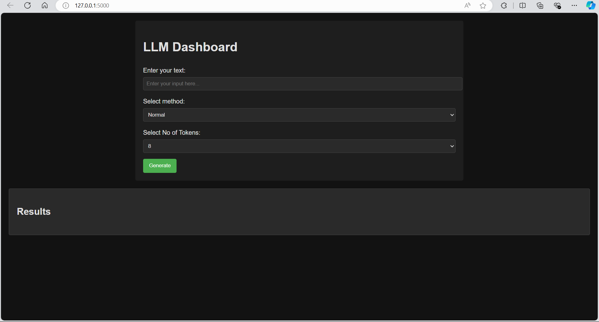
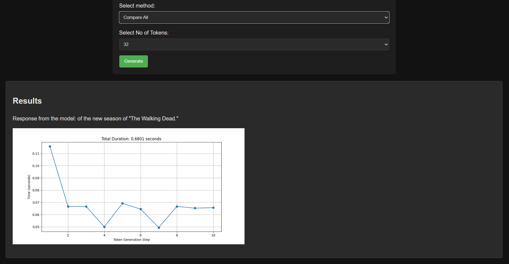

# LLM Dashboard

Welcome to the LLM Dashboard, an interactive tool for exploring different language model inference methods!



## Features

- Compare different inference methods: Normal, Caching, and Batching
- Visualize generation times with interactive graphs
- Customize token generation length

## Installation

1. Clone the repository:
   ```
   git clone https://github.com/yourusername/llm-dashboard.git
   cd llm-dashboard
   ```

2. Create a virtual environment and activate it:
   ```
   python -m venv venv
   source venv/bin/activate  # On Windows, use `venv\Scripts\activate`
   ```

3. Install the required packages:
   ```
   pip install -r requirements.txt
   ```

## Running the Application

1. Start the Flask server:
   ```
   python app.py
   ```

2. Open your web browser and navigate to `http://localhost:5000`

## Usage

1. Enter your text prompt in the input field
2. Select the inference method (Normal, Caching, or Batching)
3. Choose the number of tokens to generate
4. Click "Generate" and watch the magic happen!


## Comparing Methods

- **Normal**: Standard token-by-token generation
- **Caching**: Utilizes KV-caching for faster subsequent token generation
- **Batching**: Processes multiple inputs simultaneously for improved throughput

Experiment with different methods and observe the performance differences in the generated graphs!



## Contributing

We welcome contributions! Please see our [CONTRIBUTING.md](CONTRIBUTING.md) for details on how to get started.

## License

This project is licensed under the MIT License - see the [LICENSE](LICENSE) file for details.